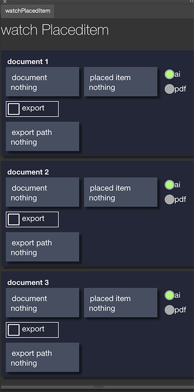
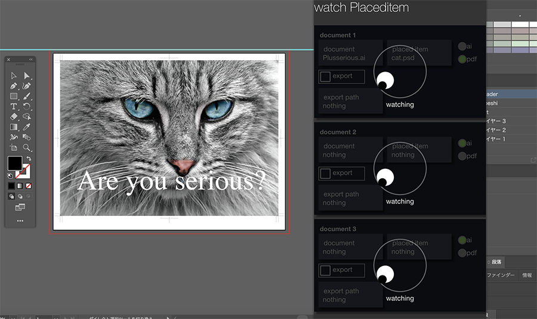

<h1>watch placed item</h1>
<h2>the Extension watchs image data and export ai or pdf through Illustrator automatically</h2>

like you create poster. something picture placed on AI data. you have to adjust picture but edit picture on Photoshop , save it and then open on Illustrator and save as a pdf or ai data. it's bit a lot work. the Extension does it instead you. 

<h3>download</h3>
<a href="https://exchange.adobe.com/creativecloud.details.104709.watchplaceditem.html">you could get Extension from here</a>

<h3>Japanese explanation</h3>
<a href="https://kawano-shuji.com/justdiary/2020/09/08/extension-watch-placed-image/">Japanese explanation is here</a>