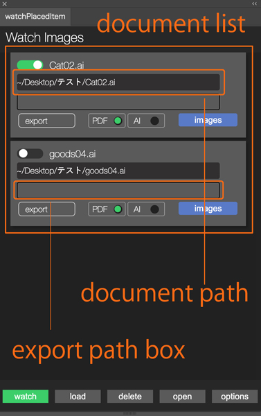
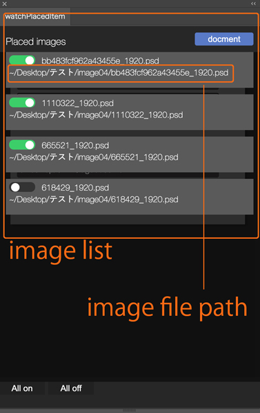
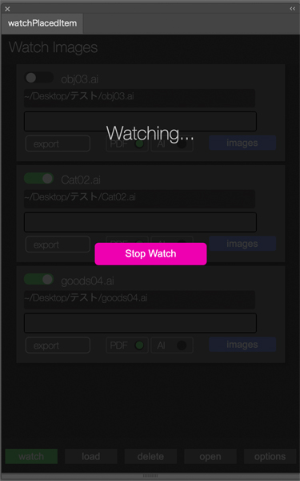

# WatchPlacedItem 2.0

like you create poster. something picture is placed on AI file. you have to adjust picture but edit picture on Photoshop, save it and then open on Illustrator and save as a pdf or ai data. it's bit a lot work. the Extension does it instead you.

the Extension loads document and placed images, and watch placed images.
it detects when images update automatically, and open document and save or export as a AI or PDF.

## Hot to use it

load documents from Illustrator and it'll load placed images as well. after load it, check documents and images you want to target to watch. 
while panel is watching images, it detects update images.
after you update all of images you checked, the panel opens document and saves again.

### buttons

1. **watch**
launch to watch 

2. **load**
load active document

3. **delete**
delete document from panel you checked

4. **open**
open and save document you checked

### options

1. **export**
export document after detected update. you can choose place to export through dialog or drag and drop.

3. **PDF ver**
option for PDF version.

4. **close**
after saveing or exporting document, it closes document automatically.

5. **time stamp**
literally time stamp.generating it on document date layer. and it updates when the Extension detects and opens document. 

